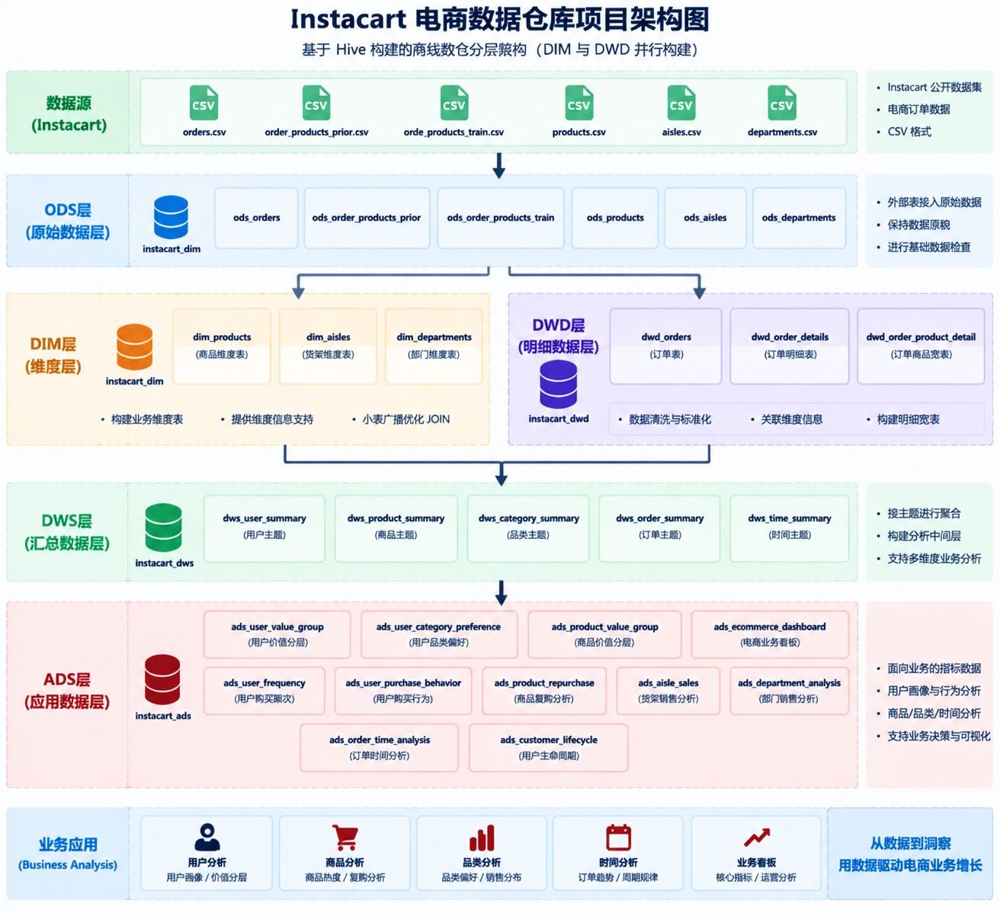
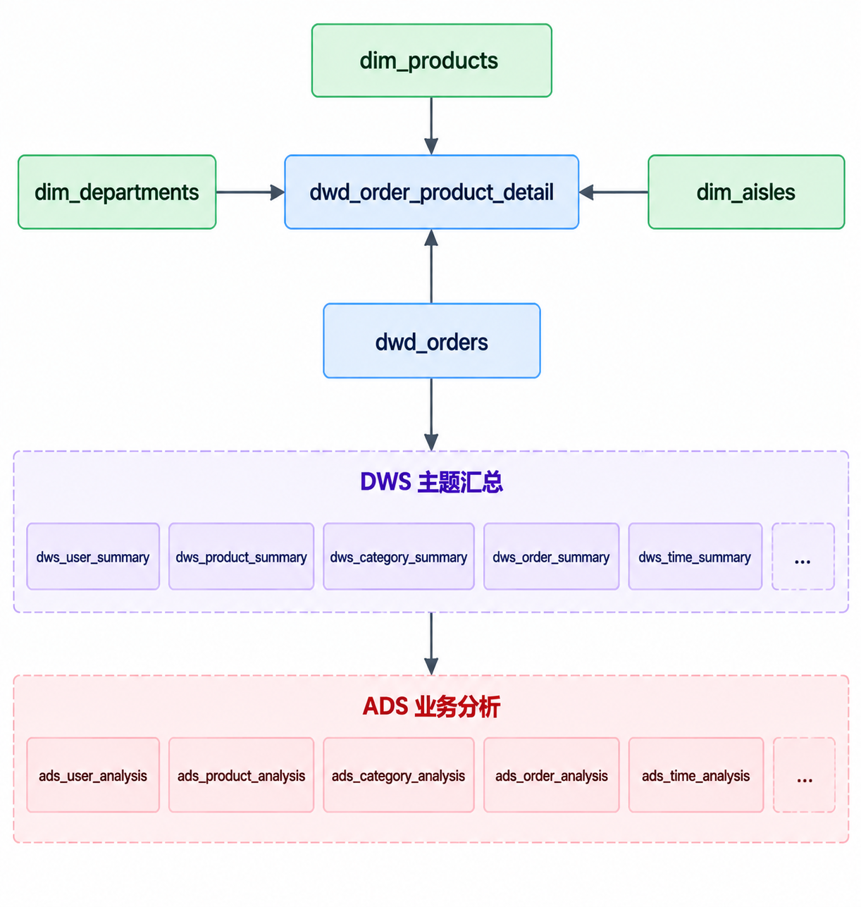
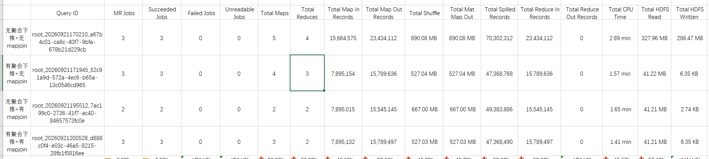

# Instacart 用户购物行为离线数仓项目

## 1. 项目介绍

本项目基于 Hadoop、Hive 与 Spark SQL 构建一个电商离线数据仓库，模拟企业中从原始业务数据接入、数据清洗、维度建模、主题汇总到业务指标输出的完整离线数仓流程。

项目采用：
```text
ODS → DWD → DIM → DWS → ADS
```

五层架构，对用户、商品、订单、订单明细和用户行为等电商数据进行处理。

## 2. 项目背景

Instacart 是一家在线杂货购物与配送平台。

平台积累了大量用户历史购物数据，包括：

- 用户订单
- 商品信息
- 商品所属 aisle
- 商品所属 department
- 用户购买商品记录
- 商品加入购物车顺序
- 商品是否属于重复购买
- 用户下单时间
- 用户两次订单之间的时间间隔

业务部门希望基于历史数据建设一套离线数据仓库，为用户运营、商品运营和经营分析提供稳定的数据支持。

项目需要基于 Instacart 公开数据集完成完整的数据处理流程，并最终形成可复用的数据分析结果。


## 3. 技术栈

| 类型 | 技术 |
|---|---|
| 开发语言 | SQL、Shell、Python |
| 数据仓库 | Apache Hive |
| 计算引擎 | SparkSQL、MapReduce |
| 存储系统 | HDFS |
| 数据格式 | TextFile、ORC |
| 数据调度 | Shell脚本 |
| 开发环境 | Ubuntu + VMware |


## 4. 数据来源


**Instacart Market Basket Analysis**

Kaggle：

https://www.kaggle.com/competitions/instacart-market-basket-analysis/data

## 5. 数仓架构

### 5.1 具体架构图

<div align="center">



</div>

### 5.2 指标解释

- 用户购物频率分析（ads_user_frequency）采用 NTILE(5) 函数，以用户订单数量（order_cnt）作为主要排序指标，并结合平均购物周期（avg_prior_order）进行等级划分。level=1 的用户订单频率最高，定义为高频购物用户；level=5 的用户定义为低频购物用户；其余等级用户定义为普通用户。同时，将订单数量 order_cnt≤2 的用户提前划分为低订单用户。

- 商品复购分析（ads_product_reordered）与货架复购分析（ads_aisle_analysis）、维度复购分析（ads_department_analysis）均采用 NTILE(5) 函数，以商品复购率（reordered_ratio）作为主要排序指标。level=1 的商品复购率最高，定义为高复购商品；level=5 的商品定义为低复购商品；其余等级商品定义为普通商品。同时，将订单数量 order_cnt≤2 的商品提前划分为低销量商品。

- 订单规模分析（ads_order_analysis）采用 NTILE(5) 函数，以订单商品数量（product_cnt）作为主要排序指标。level=1 定义为大订单；level=5 定义为小订单；其余为普通订单。

- 用户价值分层（ads_user_value_group）基于用户订单频次、购买商品数量、商品多样性以及复购比例四个指标构建综合评分模型。首先采用 NTILE(5) 函数对各指标进行五等分分层，并按照 30%、25%、15%、30% 的权重计算用户价值评分（value_score）。根据评分结果将用户划分为高价值用户、活跃用户、普通用户和低活跃用户，用于衡量用户贡献程度和消费价值。

- 商品价值分层（ads_product_value_group）基于商品购买人数、商品销量以及商品复购比例三个指标构建综合评分模型。首先采用 NTILE(5) 函数对各指标进行五等分分层，并按照 30%、35%、35% 的权重计算商品价值评分。根据综合评分、复购水平以及销量表现，将商品划分为核心商品、高复购商品、热门商品和长尾商品，用于识别不同价值等级的商品，为商品运营和销售策略制定提供数据支持。

## 6. 数据模型设计

本项目围绕订单商品明细表构建核心事实模型，通过关联商品、货架、部门等维度表形成面向多主题分析的星型模型，并在此基础上进行用户、商品、品类和时间等主题聚合。

<div align="center">



</div>
    

## 7. 项目流程

### 7.1 数据处理流程

项目整体 ETL 流程如下：

```text
原始 CSV 数据

↓

ODS 数据接入

↓

DWD 数据清洗与明细加工

↓

DIM 维度构建

↓

DWS 多主题聚合

↓

ADS 业务指标生成

↓

业务分析
```

### 7.2 ETL 执行流程


```text
run_all.sh
    │
    ├── 01-init_hdfs.sh
    ├── 02-run_databases.sh
    ├── 03-run_ods.sh
    ├── 04-run_dim.sh
    ├── 05-run_dwd.sh
    ├── 06-run_dws.sh
    └── 07-run_ads.sh
```


## 8. 核心SQL

### 8.1 DWD订单商品宽表构建


通过订单明细表关联订单表和商品维度表，生成后续分析使用的宽表。


```sql
INSERT OVERWRITE TABLE dwd_order_product_detail

SELECT /*+ MAPJOIN(p) */

    o.order_id,
    o.user_id,
    od.product_id,
    o.order_number,
    p.aisle_id,
    p.department_id,
    od.reordered

FROM dwd_order_details od

JOIN dwd_orders o

ON od.order_id=o.order_id

JOIN dim_products p

ON od.product_id=p.product_id;
```

优化点：

- 商品维度表使用 MapJoin
- 减少 Shuffle 数据量
- 提升 JOIN 性能

### 8.2 用户复购率分析

计算用户购买次数和复购比例：
```sql
select

user_id,

count(product_id),

sum(reordered)/count(product_id)

from dwd_order_product_detail

group by user_id;
```

应用：

- 用户价值分析
- 用户分群

### 8.3 商品复购分析

基于商品销售次数和复购次数计算商品复购率：
```sql
select

product_id,

count(*) as sale_cnt,

sum(reordered) as reordered_cnt

from dwd_order_product_detail

group by product_id;
```

应用：

- 商品排行
- 高复购商品识别

## 9. 性能优化

### 1. 聚合下推（Aggregation Pushdown）优化

针对品类分析任务中事实表与维度表关联阶段产生的数据传输开销问题，对 SQL 执行逻辑进行优化。

#### 优化前

原 SQL 先将订单商品明细表与部门维度表进行 JOIN，再按照业务维度进行聚合统计。

```text
dwd_order_product_detail

          |

          JOIN dim_departments

          |

          GROUP BY department_id

          |

          聚合结果
```

通过 SQL 执行计划（EXPLAIN）和 MapReduce 运行指标分析发现，原 SQL 在明细数据级别完成 JOIN，大量事实表记录参与关联和后续聚合计算。同时聚合过程中包含 `COUNT DISTINCT` 等去重操作，需要对大量中间数据进行 Shuffle 和排序，导致较大的网络传输开销以及磁盘 Spill。

针对上述问题，将聚合操作提前，在事实表内部先完成业务维度聚合，减少参与 JOIN 的数据规模，再进行维度关联，从而降低后续计算阶段的数据处理压力。

#### 优化后

优化后的执行流程调整为：

* 先对订单商品明细按照 `department_id` 进行聚合，提前计算用户数、订单数以及复购率等指标；
* 再与部门维度表进行关联，补充部门名称等维度信息。

```text
dwd_order_product_detail

          |

          GROUP BY department_id

          |

          小规模聚合结果

          |

          JOIN dim_departments

          |

          最终结果
```

#### 优化效果

在关闭 MAPJOIN、保持其他执行条件一致的情况下，对比优化前后的 MapReduce 执行指标：

| 指标              |       优化前 |       优化后 |     变化 |
| --------------- | --------: | --------: | -----: |
| Total Shuffle   | 890.08 MB | 527.04 MB | ↓40.8% |
| Spilled Records |    7030 万 |    4736 万 | ↓32.6% |
| CPU Time        |  2.89 min |  1.57 min | ↓45.7% |

优化后，提前聚合减少了参与 JOIN 的明细数据规模，有效降低了 Shuffle 数据传输量以及中间数据 Spill 开销，提高了任务执行效率。

同时，进一步测试 MAPJOIN 优化后发现，在聚合下推基础上继续使用 MAPJOIN，Shuffle 可进一步降低至 527.03 MB，CPU Time 降低至 1.41 min，说明两种优化策略可以叠加使用，但在当前数据规模下，聚合下推对性能提升贡献更加明显。

<div align="center">



</div>

SQL 代码详情见：

`02-sql/optimization/9.1-department_summary.sql`

---


## 10. 项目运行

### 10.1 环境要求

项目运行环境：

- Linux
- Hadoop
- Hive
- Beeline
- ORC存储格式
- MapReduce计算引擎

### 10.2 数据准备

将 Instacart 原始 CSV 数据上传至 Hadoop HDFS：

```
/warehouse/instacart/source/
```

数据目录结构：

```
source
├── orders
├── order_products_prior
├── order_products_train
├── products
├── aisles
└── departments
```


### 10.3 执行 ETL 流程

项目按照数仓分层顺序执行：
```
01 ODS数据接入
        |
        v
02 DIM维度构建
        |
        v
03 DWD明细加工
        |
        v
04 DWS主题聚合
        |
        v
05 ADS业务分析
```

执行脚本：
```
bash run_all.sh
```

### 10.5 运行结果检查

执行完成后，可以通过 Hive 查看生成结果：

查看数据库：
```sql
show databases;
```
查看表：
```sql
show tables in instacart_ads;
```
查看数据：
```sql
select *
from instacart_ads.ads_user_value_group
limit 10;
```

### 10.6 执行耗时

在本地 Hadoop + Hive 环境下完成完整 ETL 流程：

| 模块  | 主要任务   | 耗时     |
| --- | ------ | ------ |
| ODS | 原始数据接入 + 数据量检查 | 5 min |
| DIM | 维度表构建  | 2.86 min |
| DWD | 明细数据加工 | 7.84 min |
| DWS | 主题聚合计算 | 22.37 min |
| ADS | 业务指标生成 | 36.75 min |


整体执行时间约 1 h 15 min 分钟。

## 11. 问题记录

### 1. Hive External Table 创建后查询无数据

#### 问题描述

首次创建 ODS 外部表时未指定 `LOCATION`，Hive 默认将表数据路径设置为：

```
/warehouse/instacart_ods.db/ods_orders
```

后续上传数据到：

```
/warehouse/instacart/source/orders
```

并重新执行带 `LOCATION` 的建表语句，但由于使用：

```sql
CREATE TABLE IF NOT EXISTS
```

Hive 不会修改已经存在表的元数据，因此仍然读取原来的路径，导致查询无数据。

---

#### 原因分析

Hive 表由 **Metastore 元数据** 和 **HDFS 数据文件** 两部分组成。

* Metastore 保存表结构和 LOCATION 信息；
* HDFS 保存实际数据文件。

建表后修改 `LOCATION` 不会自动更新已有表，需要重新创建表。

---

#### 解决方案

删除错误创建的数据库：

```sql
DROP DATABASE IF EXISTS instacart_ods CASCADE;
```

重新创建数据库和外部表，并指定正确路径：

```sql
LOCATION '/warehouse/instacart/source/orders';
```

---

#### 经验总结

* 创建 Hive 表时应提前确定 `LOCATION` 路径；
* `CREATE TABLE IF NOT EXISTS` 只能避免重复创建，不能修改已有表配置；
* 开发阶段修改表结构或路径时，可以使用：

```sql
DROP TABLE IF EXISTS table_name;
```

重新创建。

---


### 2. Hive 自动 MapJoin 导致 MapredLocalTask 执行失败

#### 问题现象

执行 Hive Join 查询时出现：

```

FAILED: Execution Error, return code 1 from org.apache.hadoop.hive.ql.exec.mr.MapredLocalTask

```

#### 问题原因

Hive 开启自动 MapJoin 后，会根据表大小判断是否将小表加载到本地内存生成 HashTable。

当 Hive 误判某张表为小表，但实际数据量较大时，本地生成 HashTable 会占用大量内存，导致 MapredLocalTask 阶段失败。

#### 解决方法

关闭自动 MapJoin，使用普通 MapReduce Join：

```sql
set hive.auto.convert.join=false;
```

重新执行任务即可。

后续生产环境中应通过收集表统计信息（ANALYZE TABLE）或合理配置 MapJoin 参数，避免错误判断。

---


### 3. Hive Map端聚合兼容性问题

#### 问题描述

在使用 Hive 执行包含 `GROUP BY` 的 SQL 时，`EXPLAIN` 阶段出现执行计划生成失败的问题。

排查发现：

- 普通 `SELECT` 正常；
- `JOIN` 正常；
- 添加 `GROUP BY` 后失败。

原因定位为 Hive 开启 Map 端聚合优化：

```sql
SET hive.map.aggr=true;
```

在当前环境：

```
Hive 4.2.1
Hadoop 3.4.1
Java 21
```

生成 Map-side GroupBy 执行计划时存在兼容性问题。

#### 解决方案

关闭 Map 端聚合：

```sql
SET hive.map.aggr=false;
```

关闭后 `EXPLAIN` 可以正常生成执行计划，SQL 正常执行。

#### 说明

Map 端聚合可以减少 Shuffle 数据量，生产环境通常保持开启。本项目由于实验环境兼容性问题关闭该优化参数。

---

### 4. Hive MapJoin LocalTask问题

在使用 Hive MapJoin 优化事实表关联维表时，执行阶段出现：

```
MapredLocalTask return code 1
```

排查发现：
Hive 默认通过子 JVM 执行 LocalTask：

```
hive.exec.submit.local.task.via.child=true
```

在当前环境：

```
Hive 4.0.0
Hadoop 3.4.3
Java 11
MapReduce
```

下，MapJoin LocalTask 子 JVM 初始化失败。

#### 解决：

关闭子 JVM 执行：

```
set hive.exec.submit.local.task.via_child=false;
```

修改为：

```
hive.exec.submit.local.task.via.child=false
```

同时提升 HiveServer2 JVM 堆内存至：

**-Xmx1024m**

修改后 MapJoin 可以正常执行。
                                                                         
---


## 12. 项目总结

本项目完成了一套基于 Hive 的电商离线数仓建设，围绕 Instacart 用户购物行为数据，完成了从数据采集、数据建模、ETL 加工到业务分析应用的完整流程。

项目采用分层数仓架构，将原始数据通过 ODS 层接入，经 DWD 层清洗加工后，结合 DIM 维度表构建明细模型，并在 DWS 层完成多主题聚合，最终通过 ADS 层输出面向业务分析的指标数据。

在开发过程中，重点实践了 Hive SQL 开发、复杂 JOIN 优化、窗口函数分析、用户及商品价值分层等技术方案，并通过 MapJoin、聚合下推等方式优化查询性能。

通过该项目，加深了对离线数仓开发流程和数据分析业务场景的理解，为后续进行更大规模数据处理和数据平台开发积累了实践经验。